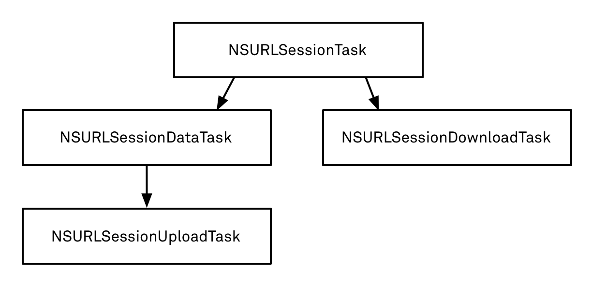

# 网络编程之 NSURLSession

### 一、简介

iOS 7 和 Mac OS X 10.9 Mavericks 中一个显著的变化就是对 Foundation 的 [URL Loadin System](https://developer.apple.com/documentation/foundation/url_loading_system?language=objc) 的彻底重构。

NSURLConnection 作为 Core Foundation / CFNetwork 框架的 API 之上的一个抽象，在 2003 年，随着第一版的 Safari 的发布就发布了。NSURLConnection 这个名字，实际上是指代的 Foundation 框架的 URL Loading System 系统中一系列有关联的组件：NSURLRequest、NSURLResponse、NSURLProtocol、 NSURLCache、 NSHTTPCookieStorage、NSURLCredentialStorage 以及同名类 NSURLConnection。

在 2013 的 WWDC 上，苹果推出了 NSURLConnection 的继任者：NSURLSession。现在使用大多数主流第三方框架都已经从 NSURLConnection 迁移到了 NSURLSession，比如 AFNetworking、SDWebImage 等等都使用了 NSURLSession。     

和 NSURLConnection 一样，NSURLSession 指的也不仅是同名类 NSURLSession，还包括一系列相互关联的类。NSURLSession 包括了与之前相同的组件，NSURLRequest 与 NSURLCache，但是把 NSURLConnection 替换成了 NSURLSession、NSURLSessionConfiguration 以及 NSURLSessionTask 的 3 个子类：NSURLSessionDataTask，NSURLSessionUploadTask，NSURLSessionDownloadTask。                                                                                       

### 二、URL Loading System

URL Loading System 是一系列的用来访问通过 URL 来定位的资源的类和协议。这项技术的核心在于基于 `NSURL` 来访问资源，除了加载 URL 的类之外，我们把其他相关辅助类分为 5 类：

-  协议支持（protocol support）
-  权限认证（authentication and credentials）
-  cookie 存储（cookie storage）
-  请求配置（configuration management）
-  缓存管理（cache management）

#### 1. URL 加载

URL Loading System 最常用的类就是用来根据 URL 请求数据的类 `NSURLSession`。按照获取数据后保存的位置，可以分为两种形式。

- 获取二进制数据（内存）
- 下载文件到本地

#### 2. 辅助类

2.1 URL 请求

`NSURLRequest` 将 URL 和请求协议相关的属性封装起来了。
比如，支持 HTTP 协议的 `NSURLRequest`/`NSMutableURLRequest ` 类的就包括读取/设置请求方式、请求体、请求头等属性的方法。

2.2 响应元数据

服务器返回的数据包括两部分：

- 描述内容数据的元数据
- 内容数据本身

描述内容数据的元数据往往是请求协议定义的，`NSURLResponse ` 会将元数据和内容数据本身封装起来，大部分协议都有的元数据包括 MIME type、 expected content length、text encoding (where applicable)、以及产生这个响应的 URL。

#### 3. 重定向（改变请求）

有些协议，比如 HTTP，提供了一种重定向机制：当你发起一个请求时，而你请求的资源的 URL 已经发生改变了，服务器就会告诉客户端你请求的资源已经被转移到了新的 URL。

我们可以通过实现相关的代理方法，来拦截重定向事件，并决定是否需要重定向到新的地址。

#### 4. 权限认证
有些服务器会对某些特定的内容限制访问权限，只对提供了信任证书通过认证的用户提供访问资格。

URL Loading System 提供了封装证书（credentials ）和保存安全凭证（secure credential）的类：

- `NSURLCredential`：
- `NSURLCredentialStorage`
- `NSURLAuthenticationChallenge`

#### 5. 缓存管理

#### 6. cookie 存储

#### 7. 协议支持

### 三、NSURLSession 的使用
NSURLSession 负责发送请求和接收响应，

#### 1. NSURLSessionTask

#### 2. NSURLSession 的 delegate 方法

#### 3. NSURLSessionConfiguration

### 四、NSURLSession 和 NSURLConnection 的对比，为什么 NSURLConnection 会被 NSURLSession 所替代？

问题：

5. 何时需要使用以及如何使用 NSURLProtocol？

6. AFNetworking 为什么要对 NSURLConnection/NSURLSession 进行封装？它是如何封装的？

7. AFNetworking 2.x 和 AFNetworking 3.x 的区别是什么？

8. 为什么 SDWebImage 早期版本中使用 NSURLConnection 异步下载时，需要手动启动 Runloop 来实现线程的保活，而现在版本中使用 NSURLSession 时，却不需要呢？

### 参考：
- [NSURLSession and NSDefaultRunLoopMode](https://stackoverflow.com/questions/20098106/nsurlsession-and-nsdefaultrunloopmode)
- [NSURLSession与NSURLConnection区别](http://www.guiyongdong.com/2016/11/18/NSURLSession与NSURLConnection区别/)
- [NSURLSession VS. NSURLConnection](https://stackoverflow.com/questions/33919862/nsurlconnection-vs-nsurlsession)
- [iOS网络基础——NSURLSession使用详解(一般访问、文件下载、上传)](https://www.jianshu.com/p/2bd9cb569fc2)
- [WWDC Session 705: "What’s New in Foundation Networking"](http://asciiwwdc.com/2013/sessions/705)
